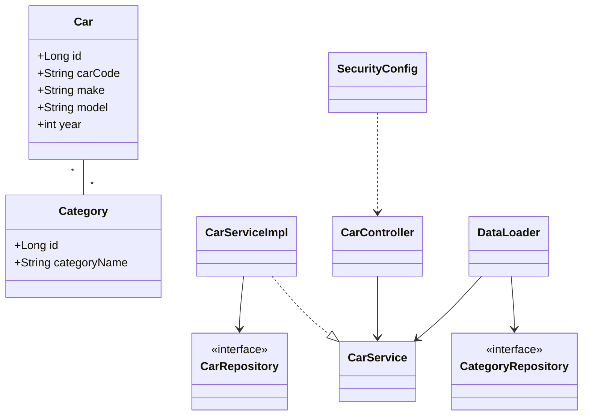

# Car Service REST API

A Spring Boot 3 (Java 17) REST API for managing cars and their categories with JWT-based OAuth2 resource server security, pagination/filtering via JPA Specifications, Flyway migrations, and OpenAPI/Swagger documentation.

## Features
- CRUD endpoints for `Car`
- Many-to-many relation between `Car` and `Category`
- Filtering by make, model, year range, and category
- Pagination & sorting
- OAuth2 Resource Server (JWT) with fine-grained scopes
- Flyway database migrations
- Testcontainers-backed integration tests
- OpenAPI/Swagger configuration

## Tech stack
- Spring Boot 3.1.x, Java 17
- Spring Web, Spring Data JPA, Validation
- Spring Security (OAuth2 Resource Server, JWT), Okta/Auth0 starter
- PostgreSQL (runtime), H2/Testcontainers in tests
- Flyway for DB migrations
- Lombok
- springdoc-openapi
- Maven

## Project layout
```
carservicerest/
  ├─ src/main/java/ua/foxminded/carservicerest
  │   ├─ controller/        # REST controllers
  │   ├─ model/             # JPA entities, DTOs, enums
  │   ├─ repository/        # Spring Data repositories
  │   ├─ security/          # Security configuration
  │   ├─ service/           # Service interfaces and implementations
  │   └─ util/              # Specifications, OpenAPI config, DataLoader
  ├─ src/main/resources
  │   ├─ application.properties
  │   ├─ application.yml
  │   └─ db/migration/      # Flyway SQL migrations
  ├─ src/test/java
  │   └─ ...                # Integration tests with Testcontainers
  ├─ pom.xml
  ├─ openApi.yaml           # (empty placeholder)
  ├─ compose-dev.yaml       # Local postgres (blog_* sample)
  └─ file.csv               # Optional seed data for DataLoader (non-test profile)
```

## UML (Mermaid)
Class diagram of core domain and layers:



## API overview
Base path: `/api/v1/cars`

- GET `/api/v1/cars`
  - Query params: `page`, `size`, `sortDerection` (ASC|DESC), `sortBy` (ID|MAKE|MODEL|YEAR), `make`, `model`, `minYear`, `maxYear`, `category`
  - Auth: JWT required (any authenticated user)

- POST `/api/v1/cars`
  - Body: `CarDto { carCode, make, model, year, categories[] }`
  - Auth: Scope `create:car`

- PATCH `/api/v1/cars/{id}`
  - Body: `CarDto`
  - Auth: Scope `update:car`

- DELETE `/api/v1/cars/{id}`
  - Auth: Scope `delete:car`

Validation errors return RFC7807 `application/problem+json` with details.

## Getting started
### Prerequisites
- Java 17
- Maven 3.9+
- PostgreSQL (or run tests with Testcontainers)

### Local database (option A)
1. Create PostgreSQL DB and user matching `src/main/resources/application.properties` or override via env:
   - `SPRING_DATASOURCE_URL=jdbc:postgresql://localhost:5432/carservicerest`
   - `SPRING_DATASOURCE_USERNAME=postgres`
   - `SPRING_DATASOURCE_PASSWORD=1234`
2. Flyway will migrate schema on startup.

### Local database with Docker (option B)
A sample `compose-dev.yaml` is included but references a `blog` DB/user; adjust to `carservicerest` or create matching env.

```bash
docker compose -f carservicerest/compose-dev.yaml up -d
```

Update variables to:
- `POSTGRES_DB=carservicerest`
- `POSTGRES_USER=postgres`
- `POSTGRES_PASSWORD=1234`

### Run the app
```bash
mvn -f carservicerest/pom.xml spring-boot:run
```
The app will start on `http://localhost:8080`.

### Security & JWT
Configure issuer/audience in `application.yml` (currently points to Auth0 dev). Endpoints require JWT with scopes as configured in `SecurityConfig`.

### OpenAPI/Swagger
springdoc is configured. Visit `http://localhost:8080/swagger-ui.html` once running. Security scheme is JWT Bearer.

## Testing
Integration tests use Testcontainers for PostgreSQL.

```bash
mvn -f carservicerest/pom.xml test
```

## Data loader (non-test profile)
On startup, `DataLoader` seeds data from `file.csv` if the database is empty and profile is not `test`.

## License
MIT (or update to your license).
